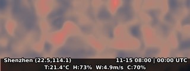

skyweaver-sz
Weather Art Visualization for Shenzhen.
## Shenzhen Weather Art Visualization

> Terrain animation driven by weather data, artistically visualizing the meteorological "breath" of Shenzhen.

---

<!-- Screenshot below generated via: python src/main.py --screenshot docs/screenshot.png -->


<!-- To refresh the screenshot: rerun the command above after modifying palettes or rendering logic. -->

---

## Data Source
- **Source**: [Open-Meteo](https://open-meteo.com/)
- **API**: `https://api.open-meteo.com/v1/forecast`
- **Request Parameters**: `latitude, longitude, past_days, forecast_days, hourly=temperature_2m,relative_humidity_2m,wind_speed_10m,cloud_cover, timezone=UTC`
- **License**: Free and public, see [Open-Meteo License](https://open-meteo.com/en/docs#license)

---

## Installation Steps
```bash
# 1. Create a virtual environment (recommended)
python -m venv .venv
.venv\Scripts\activate  # Windows
# or source .venv/bin/activate  # macOS/Linux

# 2. Install dependencies
pip install -r requirements.txt

# 3. Install ffmpeg (recommended for mp4 export)
# Windows: Use choco install ffmpeg or download release
# macOS:   brew install ffmpeg
# Linux:   sudo apt install ffmpeg
```

---

## Example Usage and Parameters

### Easiest way to run (default preview mode)
```bash
# Use the batch script (recommended)
run.bat

# Or run Python directly
python src/main.py
```

### Quick preview of different effects
```bash
run.bat --palette coral           # Coral theme
run.bat --palette twilight        # Twilight theme
run.bat --palette deepsea         # Deepsea blue-green (new)
run.bat --accent 0.5              # Stronger highlight effect
run.bat --palette dusk --accent 0.8 # Cool blue-violet main + strong red highlight
```

### Save to file mode
```bash
run.bat --save --out my_weather.mp4    # Save as mp4
run.bat --save --days 7                # Save 7 days of data
```

### Parameter Description
- `--save`      Enable save mode (default is preview mode)
- `--days`      Get past N days + next day data (default 3)
- `--fps`       Animation frame rate (default 18, smoother)
- `--palette`   Palette theme (dusk=cool blue-violet/coral=warm orange/twilight=magenta/deepsea=deep blue-green)
- `--accent`    Highlight parameter 0~1 (default 0.2, increases brightness and red phase when raised)
- `--width`     Output width (default 320)
- `--height`    Output height (default 120)
- `--out`       Output file path (required for save mode)
- `--inbetweens` Number of interpolated frames between adjacent hours (smoother animation, default 0)

### UI Description
- **Bottom Info Bar**: Semi-transparent black background bar for enhanced contrast, two-line layout to avoid overlap
  - First line: Left - city coordinates, Right - local time and UTC time
  - Second line: Centered full weather data (temperature/humidity/wind/cloud)
- **Preview Title**: Shenzhen Weather Daily
- **High-Definition Display**: 8px font with 2px black stroke for clarity
- **Anti-Aliased Text**: Optimized font rendering for clear, alias-free text in GIF exports

### Palette Details
- **dusk**: Cool blue-violet main, warm color only as highlight in top 10% intensity, accent increases red
- **coral**: Mist blue to warm orange-coral, warm and bright
- **twilight**: Blue-green to violet to magenta, mysterious twilight
- **deepsea**: Deep blue to cyan-green to sea mist gray, overall low saturation
- `--out`       Output file path (required for save mode)
- `--inbetweens` Number of interpolated frames between adjacent hours (smoother animation, default 0)

### Usage Tips
- **Quickest experience**: Just run `run.bat` to see the effect
- **Parameter tuning**: Try `run.bat --palette coral --accent 0.3` etc.
- **Final output**: `run.bat --save --out final.mp4` to generate a file

---

## Data and Visual Mapping
- **Temperature** → Terrain amplitude (vertical relief)
- **Wind speed** → Terrain drift speed (horizontal flow)
- **Cloud cover** → Haze intensity (gamma haze)
- **Humidity** → Color temperature (cool/warm tone)

---

## Caching Strategy and Timezone
- Weather data cached at `data/weather_shenzhen.parquet`, auto-refreshed hourly, falls back to old cache on network failure.
- Data indexed by UTC, animation title automatically marks local timezone (Asia/Shanghai) and UTC time.

---

## FAQ & Troubleshooting
- **ffmpeg missing**: Cannot export mp4, will automatically fall back to GIF. Please install ffmpeg for higher quality animation.
- **Network failure**: If API request fails, will automatically use local cached data (if available).
- **Missing dependencies**: Please ensure all requirements in requirements.txt are installed, and at least one of pyarrow or fastparquet is present.

---


---

## Project Statement

This project visualizes the dynamic weather of Shenzhen through generative terrain animation, driven by real hourly meteorological data from [Open-Meteo](https://open-meteo.com/). Temperature, humidity, wind speed, and cloud cover are mapped to distinct visual parameters: temperature controls terrain amplitude, wind speed affects horizontal drift, cloud cover modulates haze intensity, and humidity adjusts color temperature. The animation blends multiple layers of procedural noise and dynamic distortion, enhanced by custom palettes (dusk, coral, twilight, deepsea) to achieve a rich, atmospheric aesthetic. The interface emphasizes clarity and beauty, with a bottom info bar displaying city coordinates, time, and live weather data. Built with Python, matplotlib, numpy, and scipy, the workflow supports mp4/GIF export and runs on major operating systems. All dependencies and parameters are documented for easy reproduction and customization, ensuring both scientific accuracy and artistic expressiveness.

## License & Credits
This project is licensed under the MIT License.
Weather data provided free by [Open-Meteo](https://open-meteo.com/), thanks to their open API.
